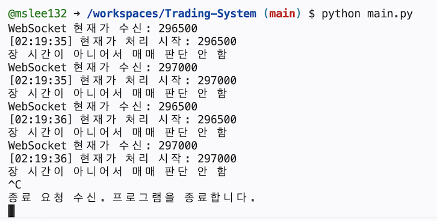
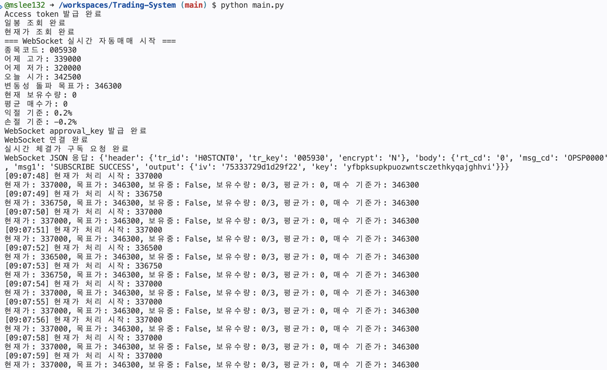
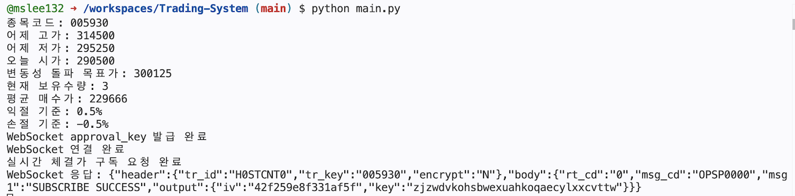

# KIS WebSocket Auto Trading System

한국투자증권 Open API를 활용한 **WebSocket 기반 실시간 자동매매 시스템**입니다.

이 프로젝트는 한국투자증권 모의투자 계좌를 사용하여 실시간 시세를 수신하고, 정해진 매매 조건에 따라 자동으로 매수·매도 주문을 실행하는 Python 프로그램입니다.

---

## 실행 화면
### 1. 장 시간이 아닌 경우



### 2. 장 시간인 경우


이 시스템은 변동성 돌파 전략을 사용하므로, 현재가가 매수기준가(목표가)를 돌파해야만 매수가 발생합니다.

위 사진과 같이 주식 현재가가 시가 대비 하락 중인 경우, 매수가 잘 이루어지지 않습니다.

이는 코드 오류가 아니며, 단순히 전략 조건이 충족되지 않았기 때문에 발생하는 현상입니다.

하락장보다 상승장에서 매수가 원활히 이루어집니다. (실행 사진 업데이트 예정)

### 3. 기보유주식이 있는 경우 종목정보


다만, 위 사진은 익절/손절 기준이 +/-0.5%일 때의 로그이지만, 변동성 돌파 목표가는 익절/손절 기준과 무관하므로 0.3% 기준일 때와 동일한 목표가입니다.

현재 코드에서는 매수 후 추가 매도 및 매도가 더 원활히 이루어지도록 익절/손절 기준을 0.3%로 하향조정한 상태입니다.

---

## 프로젝트 개요

이 시스템은 한국투자증권 Open API를 이용해 다음과 같은 흐름으로 동작합니다.

```text
한국투자증권 WebSocket
        ↓
실시간 현재가 수신
        ↓
자동매매 전략 판단
        ↓
REST API로 매수/매도 주문
        ↓
잔고 조회 및 보유 상태 동기화
```

즉, 시세 데이터는 WebSocket으로 실시간 수신하고, 실제 주문과 잔고 조회는 REST API를 통해 처리합니다.

---

## 왜 WebSocket과 REST를 따로 사용하는가?

이 프로젝트에서 가장 중요한 구조는 다음과 같습니다.

```text
시세 수신: WebSocket
주문 실행: REST API
```

### 1. WebSocket은 실시간 시세 수신에 적합하다

WebSocket은 한 번 연결을 열어두면 서버가 새로운 데이터를 계속 보내주는 방식입니다.

따라서 주식의 현재가, 체결가, 호가처럼 빠르게 변하는 데이터를 받을 때 적합합니다.

REST 방식으로 현재가를 계속 조회하려면 다음과 같은 구조가 됩니다.

```python
while True:
    price = get_current_price()
    time.sleep(1)
```

이 방식은 매번 서버에 요청을 보내야 하므로 비효율적입니다.

반면 WebSocket은 한 번 연결해두면 한국투자증권 서버가 실시간 체결가를 계속 보내줍니다.

```text
한국투자증권 서버
    → 현재가 299000
    → 현재가 299500
    → 현재가 300000
```

따라서 자동매매 시스템에서는 실시간 시세 수신에 WebSocket을 사용하는 것이 자연스럽습니다.

---

### 2. REST API는 주문 실행에 적합하다

매수·매도 주문은 실시간으로 계속 흘러오는 데이터가 아니라, 특정 조건이 충족되었을 때 한 번 요청을 보내는 작업입니다.

예를 들어 매수 조건이 충족되면 다음과 같은 주문 요청을 보냅니다.

```text
POST /uapi/domestic-stock/v1/trading/order-cash
```

이 요청에는 계좌번호, 종목코드, 주문수량, 주문구분 등이 포함됩니다.

즉, 주문은 다음과 같은 방식이 적합합니다.

```text
조건 충족
    ↓
REST API로 매수 주문 1회 전송
```

그래서 이 프로젝트에서는 다음과 같이 역할을 분리했습니다.

| 구분         | 사용 방식     | 역할                  |
| ---------- | --------- | ------------------- |
| 실시간 현재가 수신 | WebSocket | 가격 변화를 계속 수신        |
| 매수 주문      | REST API  | 조건 충족 시 주문 요청       |
| 매도 주문      | REST API  | 익절/손절 조건 충족 시 주문 요청 |
| 잔고 조회      | REST API  | 실제 보유 수량 확인         |
| 토큰 발급      | REST API  | API 인증 처리           |

---

## 주요 기능

이 프로젝트는 다음 기능을 포함합니다.

* 한국투자증권 WebSocket을 통한 실시간 체결가 수신
* REST API를 통한 모의투자 매수·매도 주문
* 변동성 돌파 전략 기반 목표가 계산
* 최대 3주까지 추가매수 가능
* 추가매수 전용 목표가 설정
* 익절 조건 충족 시 전량 매도
* 손절 조건 충족 시 전량 매도
* 잔고 조회를 통한 실제 보유수량 동기화
* Access Token 자동 갱신
* WebSocket approval key 발급
* WebSocket 재연결 처리
* Ctrl+C 입력 시 안전한 프로그램 종료
* 1초에 한 번만 매매 판단하도록 처리 제한

---

## 사용한 기술

* Python
* requests
* websocket-client
* python-dotenv
* 한국투자증권 Open API
* 한국투자증권 모의투자 계좌
* WebSocket
* REST API

---

## 시스템 구조

```text
1. Access Token 발급
2. 일봉 데이터 조회
3. 현재가 조회
4. 잔고 조회
5. 변동성 돌파 목표가 계산
6. WebSocket approval key 발급
7. WebSocket 연결
8. 실시간 체결가 수신
9. 매수/추가매수/매도 조건 판단
10. REST API로 주문 실행
11. 주문 후 잔고 동기화
```

---

## 매매 전략

이 프로젝트는 기본적으로 **변동성 돌파 전략**을 사용합니다.

변동성 돌파 전략은 "가격이 일정 수준 이상의 변동성을 보이며 상승하기 시작하면 상승 추세가 이어질 가능성이 높다"는 가정에 기반합니다.

즉, 단순히 현재 가격이 낮다고 매수하는 것이 아니라, 시장이 실제로 상승 움직임을 보일 때 진입하는 추세 추종(Trend Following) 전략입니다.

이 전략은 복잡한 기술적 지표를 계산하지 않아도 되며 계산을 위해 필요한 자료가 적기 때문에, 자동매매 시스템의 기본 구조를 학습하기에 적합합니다.

### 1차 매수 조건

1차 매수 목표가는 다음 공식으로 계산합니다.

```text
목표가 = 오늘 시가 + (어제 고가 - 어제 저가) × k
```

예를 들어:

```text
어제 고가 = 314,500
어제 저가 = 295,250
오늘 시가 = 290,500
k = 0.2
```

이면:

```text
목표가 = 290,500 + (314,500 - 295,250) × 0.2
목표가 = 294,350
```

현재가가 이 목표가 이상이 되면 1차 매수를 시도합니다.

---

## 추가매수 전략

이 시스템은 최대 3주까지 추가매수가 가능합니다.

기본 구조는 다음과 같습니다.

```text
0주 → 1차 매수
1주 → 추가매수 조건 충족 시 2주
2주 → 추가매수 조건 충족 시 3주
3주 → 추가매수 중단
```

추가매수 기준가는 평균 매수가를 기준으로 계산합니다.

```text
추가매수 기준가 = 평균 매수가 × (1 + add_buy_rate)
```

예를 들어:

```text
평균 매수가 = 299,000
add_buy_rate = 0.002
```

이면:

```text
추가매수 기준가 = 299,000 × 1.002
추가매수 기준가 = 299,598
```

현재가가 299,598원 이상이 되면 추가매수를 시도합니다.

---
### 왜 추가매수 기준가를 별도로 설정했는가?

처음에는 모든 매수 판단이 동일한 변동성 돌파 목표가를 기준으로 이루어지도록 구현하였습니다.

예를 들어:

```text
변동성 돌파 목표가 = 294,350
현재가 = 299,000
```

인 경우 현재가는 이미 목표가를 크게 초과한 상태입니다.

만약 추가매수 기준가를 별도로 설정하지 않으면 시스템은 다음과 같이 동작합니다.

```text
현재가 299,000
↓
1차 매수
↓
여전히 294,350 이상
↓
2차 매수
↓
여전히 294,350 이상
↓
3차 매수
```

즉, 원래 의도는 가격이 상승하는 추세를 확인하면서 단계적으로 포지션을 늘리는 것이지만, 실제로는 동일한 가격 구간에서 연속적으로 추가매수가 발생하게 됩니다.

결과적으로 최대 보유수량이 3주인 경우:

```text
0주 → 1주 → 2주 → 3주
```

가 매우 짧은 시간 안에 이루어질 수 있으며, 이는 추가매수의 의미를 상실하게 만듭니다.

이를 해결하기 위해 추가매수 전용 기준가를 도입하였습니다.

추가매수 기준가는 평균 매수가를 기준으로 계산합니다.

```text
추가매수 기준가
=
평균 매수가 × (1 + add_buy_rate)
```

예를 들어:

```text
1차 매수 가격 = 299,000
add_buy_rate = 0.2%
```

인 경우:

```text
추가매수 기준가
=
299,000 × 1.002
=
299,598
```

따라서 가격이 실제로 상승하여 299,598원 이상이 되었을 때만 추가매수가 가능합니다.

이 방식의 장점은 다음과 같습니다.

* 가격 상승이 확인된 경우에만 포지션을 확대할 수 있다.
* 동일 가격대에서 반복적으로 매수하는 문제를 방지할 수 있다.
* 추세 추종(Trend Following)의 성격을 유지할 수 있다.
* 추가매수와 물타기(Averaging Down)를 명확히 구분할 수 있다.
* 위험 관리가 더 용이하다.

즉, 추가매수 기준가를 별도로 설정한 이유는 단순히 보유수량을 늘리기 위한 것이 아니라, 실제 가격 상승이 확인될 때만 포지션을 확대하도록 만들기 위함입니다.

---

## 매도 전략

매도는 익절 또는 손절 조건이 충족되면 실행됩니다.

이때 보유 수량을 일부만 매도하지 않고 **전량 매도**합니다.

예를 들어 현재 보유수량이 3주라면:

```text
익절 조건 충족
    ↓
3주 전량 매도
```

또는:

```text
손절 조건 충족
    ↓
3주 전량 매도
```

---

## 익절 조건

기본 익절 기준은 다음과 같습니다.

```text
take_profit = 0.002
```

즉, 평균 매수가 대비 수익률이 +0.2% 이상이면 전량 매도합니다.

```text
수익률 = (현재가 - 평균 매수가) / 평균 매수가
```

---

## 손절 조건

기본 손절 기준은 다음과 같습니다.

```text
stop_loss = -0.002
```

즉, 평균 매수가 대비 수익률이 -0.2% 이하이면 전량 매도합니다.

---

## 주요 파라미터

| 변수           | 의미            | 기본값    |
| ------------ | ------------- | ------ |
| code         | 종목코드          | 005930 |
| qty          | 1회 주문 수량      | 1      |
| k            | 변동성 돌파 계수     | 0.2    |
| take_profit  | 익절 기준         | 0.002  |
| stop_loss    | 손절 기준         | -0.002 |
| cooldown     | 매도 후 재매수 대기시간 | 10초    |
| max_position | 최대 보유수량       | 3      |
| add_buy_rate | 추가매수 기준 상승률   | 0.002  |

---

## 실행 예시

```python
if __name__ == "__main__":
    run_websocket_trading_bot(
        code="005930",
        qty=1,
        k=0.2,
        take_profit=0.002,
        stop_loss=-0.002,
        cooldown=10,
        max_position=3,
        add_buy_rate=0.002,
    )
```

---

## 로그 예시

### 미보유 상태

```text
현재가: 298750, 목표가: 294350, 보유중: False, 보유수량: 0/3, 평균가: 0, 매수 기준가: 294350
```

### 보유 상태

```text
현재가: 299500, 목표가: 294350, 보유중: True, 보유수량: 1/3, 평균가: 299000, 매수 기준가: 299598, 수익률: 0.167%
```

### 매수 조건 충족

```text
1차 매수: 변동성 돌파 목표가 충족
매수 주문 성공
잔고 반영 완료. 보유수량: 1, 평균가: 299000
```

### 추가매수 조건 충족

```text
추가매수: 평균가 대비 +0.2% 충족
매수 주문 성공
잔고 반영 완료. 보유수량: 2, 평균가: 299300
```

### 익절 조건 충족

```text
수익률: 0.213%
익절 조건 충족
익절 매도 주문 성공
익절 매도 후 미보유 상태 확인
```

---

## 환경변수 설정

프로젝트 루트에 `.env` 파일을 생성합니다.

```env
KIS_APP_KEY=YOUR_APP_KEY
KIS_APP_SECRET=YOUR_APP_SECRET
KIS_CANO=YOUR_ACCOUNT_NUMBER
KIS_ACNT_PRDT_CD=01
```

주의할 점:

* `KIS_APP_KEY`와 `KIS_APP_SECRET`은 절대 GitHub에 공개하면 안 됩니다.
* `.env` 파일은 `.gitignore`에 반드시 추가해야 합니다.
* `KIS_CANO`에는 모의투자 계좌번호 8자리를 입력합니다.
* `KIS_ACNT_PRDT_CD`는 일반적으로 `01`을 사용합니다.

---

## 설치 방법

필요한 라이브러리를 설치합니다.

```bash
pip install requests websocket-client python-dotenv
```

또는 `requirements.txt`를 사용하는 경우:

```bash
pip install -r requirements.txt
```

---

## 실행 방법

```bash
python main.py
```

실행 후 다음과 같은 순서로 로그가 출력됩니다.

```text
Access token 발급 완료
일봉 조회 완료
현재가 조회 완료
=== WebSocket 실시간 자동매매 시작 ===
WebSocket approval_key 발급 완료
WebSocket 연결 완료
실시간 체결가 구독 요청 완료
```

---

## 종료 방법

프로그램 실행 중 터미널에서 다음 키를 누릅니다.

```text
Ctrl + C
```

그러면 WebSocket 연결을 닫고 프로그램이 안전하게 종료됩니다.

```text
종료 요청 수신. 프로그램을 종료합니다.
WebSocket 연결 종료 완료
프로그램 종료 완료
```

---
